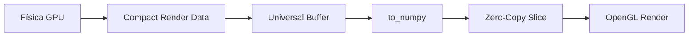

# Arquitectura de LifeSimulator 🧬🏗️

LifeSimulator utiliza un pipeline híbrido optimizado para el procesamiento paralelo masivo en la GPU.

## 🚀 Pipeline de Datos v3.0 (Ultra-Loop)

El sistema está diseñado para **UN SOLO punto de sincronización** por frame:



### Universal GPU Buffer

Todo el dato necesario para renderizar se empaqueta en un solo buffer contiguo:

```
Buffer Layout:
┌─────────────────────────────────────────────────────┐
│ Row 0-1:    Stats (vis_count, bonds, mutations...) │
│ Row 2-N:    Particle Data (x, y, r, g, b, alpha)   │
│ Row N+2-M:  Bond Vertices (x, y, ...)              │
│ Row M+2-K:  Highlight Data (pos, color)            │
│ Row K+2:    Debug Borders                          │
└─────────────────────────────────────────────────────┘
```

**Beneficios:**
- 1 sola llamada `to_numpy()` por frame
- Zero-copy slicing con NumPy views
- Latencia GPU→CPU < 0.5ms

### Total Fusion Kernels

Los kernels de física están fusionados para minimizar dispatches GPU:

| Kernel | Contenido |
|--------|-----------|
| `kernel_pre_step_fused` | Grid update + Force application |
| `kernel_resolve_constraints` | Colisiones (N iteraciones) |
| `kernel_post_step_fused` | Integración + Brownian + Coulomb + Reglas |
| `kernel_bonding` | Química (cada N frames) |

### Sistema de Reglas Modulares

Nuevas reglas de física se implementan como `ti.func` e inyectan en `kernel_post_step_fused`:

```python
@ti.func
def apply_nueva_regla_i(i: ti.i32):
    # Lógica de la regla
    vel[i] += ...

# Se llama dentro de kernel_post_step_fused
if run_advanced:
    apply_brownian_i(i, t_total)
    apply_electrostatic_forces_i(i)  # UFF implementation
    apply_vsepr_geometry_i(i)        # VSEPR stabilization
    apply_nueva_regla_i(i)
```

## 💎 Física Avanzada (2.5D + VSEPR)

### VSEPR (Valence Shell Electron Pair Repulsion)
El simulador ya no es plano. Los átomos utilizan la coordenada `pos_z` para alcanzar geometrías realistas:
- **Tetraédrica (109.5°)**: Para Carbono (sp3).
- **Angular (104.5°)**: Para Agua (H2O).
- **Lineal (180°)**: Para CO2.
- **Symmetry Breaking**: Se inducen pequeños desplazamientos en Z para evitar que las moléculas se queden "atrapadas" en un plano 2D.

### UFF (Universal Force Field) & Cargas Parciales
Las moléculas calculan sus dipolos dinámicamente:
1. Se mide la diferencia de electronegatividad con vecinos.
2. Se asigna una `partial_charge` a cada átomo.
3. Se aplican fuerzas de Coulomb ($1/r^2$) y Puentes de Hidrógeno direccionales.

## 🎨 Arquitectura de UI

- **UIConfig**: Tokens de diseño centralizados.
- **UIWidgets**: Componentes ImGui reutilizables.
- **ParticleRenderer**: VAOs para rendering masivo.

## 📂 Directorios Clave

scripts/
├── monitor.py           # LifeMonitor CLI (audit, forensic, tune, bench)
├── dev_tools.py         # Developer Suite (code audit, stats)
├── archives/            # Legacy scripts
└── advanced_molecular_analyzer.py  # Gold standard benchmark

benchmarks/
├── monitor.py           # Live monitoring
└── lab/                 # Synthetic benchmarks (bottlenecks, transfer)

src/
├── systems/
│   ├── simulation_gpu.py    # Orquestador de física
│   ├── physics_kernels.py   # Kernels fusionados
│   ├── chemistry_kernels.py # Re-exports para compatibilidad
│   ├── chemistry/           # ⭐ Paquete modular de química
│   │   ├── bonding.py       #   Formación de enlaces
│   │   ├── bond_forces.py   #   Fuerzas de resorte (Hooke)
│   │   ├── vsepr.py         #   Geometría molecular VSEPR
│   │   ├── dihedral.py      #   Fuerzas torsionales (zig-zag)
│   │   └── depth_z.py       #   Profundidad 2.5D
│   ├── molecular_analyzer.py # Inteligencia Química Unificada
│   ├── molecule_detector.py  # Detección runtime (delega a Analyzer)
│   └── taichi_fields.py     # Campos GPU centralizados
├── renderer/
│   ├── opengl_kernels.py    # Universal Buffer + Compaction
│   ├── particle_renderer.py # ModernGL VAOs
│   ├── shader_sources.py    # ⭐ GLSL shaders centralizados
│   └── camera.py            # Proyección NDC
├── core/
│   ├── frame_loop.py        # Bucle principal (tick, render)
│   ├── molecule_scanner.py  # ⭐ Escaneo de moléculas conocidas
│   ├── lod_bubbles.py       # ⭐ Burbujas LOD (zoom semántico)
│   ├── context.py           # AppContext singleton
│   └── perf_logger.py       # Logging de performance
└── config/
    └── system_constants.py  # MAX_PARTICLES, GRID_SIZE, etc.
```

## 🔄 Flujo de Frame

1. **Physics** → `simulation_step_gpu()` ejecuta física fusionada.
2. **Render Prep** → `compact_render_data()` empaqueta al Universal Buffer.
3. **Sync** → `universal_gpu_buffer.to_numpy()` (ÚNICO sync).
4. **CPU Slice** → NumPy extrae stats, particles, bonds con views.
5. **OpenGL** → `renderer.render()` dibuja con datos extraídos.

## ⚡ Optimizaciones Futuras (Opcionales)

- **Hibernación de Partículas**: Desactivar física para velocidad < 0.01.
- **GPU Instancing Puro**: Eliminar `to_numpy()` completamente.
- **Sub-stepping**: Procesar solo N% de partículas por frame.

---
*Última actualización: 2024-12-23 (v3.2)*
